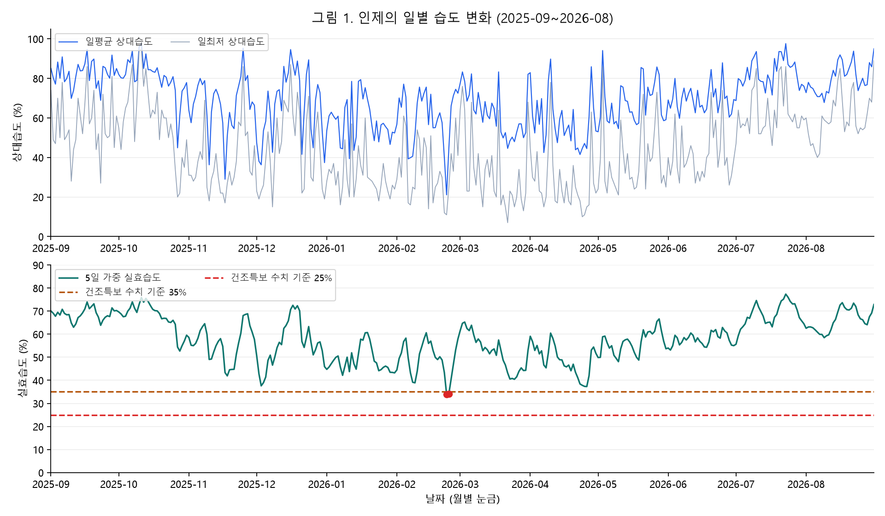
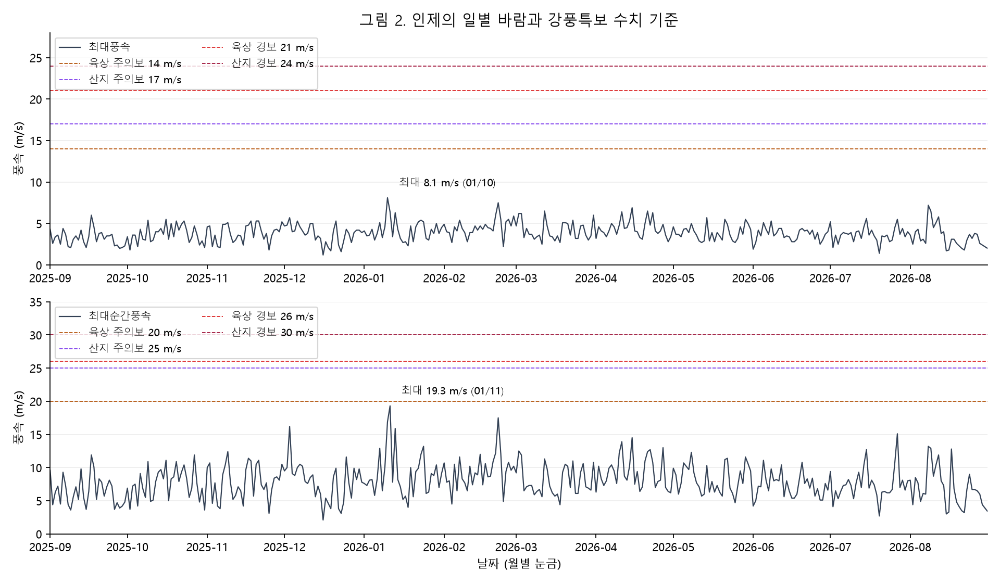
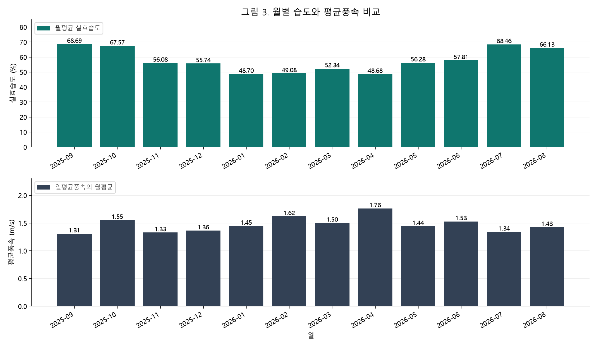

# 인제의 습도·풍속 시계열 분석: 국내 산불 연구를 바탕으로

## 1. 분석 주제 및 선정 이유

산불 관련 기상요인인 습도와 풍속이 인제에서 1년 동안 어떻게 변했는지 분석한다. 국내 선행연구는 기상요인과 산불 발생·대형화의 관련성을 다루고 있어 두 요인을 선정했다. 이번 과제는 기상 변화와 특보 수치 조건을 탐색하는 분석이며, 실제 산불 발생을 예측하거나 검증한 연구는 아니다.

## 2. 분석 질문

1. 습도는 월별로 어떻게 달라지며, 건조특보의 수치·지속 조건에 해당하는 구간은 언제인가?
2. 평균적인 바람이 강한 달과 가장 큰 순간풍속이 나타난 시기는 같은가?
3. 건조와 강풍특보 수치 기준이 같은 날짜에 충족되는가? 이 결과를 국내 산불 연구와 연결해 어디까지 해석할 수 있는가?

## 3. 데이터 설명 및 분석 방법

- 출처: [기상청 기상자료개방포털 ASOS](https://data.kma.go.kr/data/grnd/selectAsosRltmList.do?pgmNo=36)의 인제 관측소(211) 일자료.
- 분석 기간: 2025-09-01~2026-08-31, **365일**. 원본 365행·62열, 분석용 표 365행·6열.
- 핵심 변수: 날짜, 평균풍속, 최대풍속, 최대순간풍속, 평균습도, 최소습도. 단위는 m/s와 %.
- 날짜 점검: 오름차순, 중복 0건, 누락 0일. 핵심 변수 결측 0건.
- 처리 기준: 핵심 변수는 원값을 사용했다. 강수량 빈값 219개의 의미가 확인되지 않아 강수량 분석에서 제외했다. 전 기간 결측인 비핵심 변수도 제외했다. IQR 후보는 오류로 단정하지 않고 보존했다. 4월 23일 일조시간은 인근 관측소 값으로 대체하지 않았다.

시계열 분석에는 **① 5일 가중 실효습도 계산 ② 월별 집계(평균·최대·기준 충족 일수) ③ 기준 이하 연속 구간 탐색**을 적용했다. 계산용 선행 4일(2025-08-28~08-31)은 본 분석의 365일 집계에 포함하지 않았다.

기상청의 건조주의보는 실효습도 35% 이하가 2일 이상 지속될 것으로 예상될 때, 건조경보는 실효습도 25% 이하가 2일 이상 지속될 것으로 예상될 때 발표한다. [기상청 특보 발표기준](https://www.weather.go.kr/w/forecast/guide/standard.do) (확인: 2026-09-16)

이는 일평균 상대습도나 일최저 상대습도에 35%·25%를 직접 적용하는 기준이 아니다. 본 분석은 실효습도를 계산해 두 수치 이하인 날과 2일 이상 연속 구간을 구분했다. **과거 관측값의 사후 비교이며 실제 특보 발령일이나 예보 판단을 재현한 결과가 아니다.**

실효습도는 강원지방기상청 보도자료 2쪽의 5일 산출식을 적용했다.

`EH(t) = 0.3 × [RH(t) + 0.7 RH(t−1) + 0.7² RH(t−2) + 0.7³ RH(t−3) + 0.7⁴ RH(t−4)]`

RH는 일평균 상대습도(avgRhm)다. 당일을 포함한 5일을 사용하며, 산출식에 없는 가중치 재정규화는 하지 않았다. [기상청 실효습도 산출식, 2쪽](https://www.kma.go.kr/kma/servlet/NeoboardProcess?bid=gangwon01&fno=2&k=ATC202204081327142_756f55de-2b9c-4a23-aa00-3e0c9aab39e0.pdf&mode=download&num=11&ses=USERSESSION), [지상기상관측지침 2022.12, 3.3.8절](https://data.kma.go.kr/resources/images/publication/지상기상관측지침%282022.12.%29.pdf)

시작 4일을 계산하기 위해 2025-08-28~08-31 인제 일자료를 기상청 API로 추가 조회했다. 이 4일은 계산용이며 365일 분석 집계에 포함하지 않았다. 일별 실효습도는 반올림 전 계산값을 임계값과 비교했다. 표에만 소수 둘째 자리까지 표시한다. 정수 반올림을 가정해도 35% 기준 변경 0일, 25% 기준 변경 0일로 이번 결과는 동일했다. 공식 운영 시스템의 세부 반올림이나 지역별 특보 판단까지 검증한 것은 아니다.

강풍은 일최대풍속 또는 일최대순간풍속 중 하나가 기준 이상인지 비교했다. 육상 주의보는 14 또는 20 m/s, 산지 주의보는 17 또는 25 m/s, 육상 경보는 21 또는 26 m/s, 산지 경보는 24 또는 30 m/s다. 이는 실제 발령 이력이 아닌 사후 수치 비교다. 인제군 전체를 한 관측소로 대표하거나 산지로 일괄 분류하지 않는다.

## 4. 분석 결과 및 시각화

### 4.1 일별 습도와 건조 구간

실효습도 35% 이하인 날은 2026-02-23(33.92%)과 02-24(34.19%)로 **2일 연속 1구간**이었다. 25% 이하는 0일이었다. 35%·25%는 상대습도 패널에 직접 적용하지 않았다.

### 4.2 일별 바람과 기준선

일최대풍속의 기간 최댓값은 2026-01-10의 8.1 m/s, 최대순간풍속의 최댓값은 2026-01-11의 19.3 m/s다. 육상 주의보 수치 조건에 도달한 날은 0일이며 더 높은 기준도 0일이었다. 따라서 건조와 강풍 기준의 같은 날짜 충족도 0일이다. 이는 산불 위험이 없었다거나 습도와 풍속이 무관하다는 뜻이 아니다.

### 4.3 월별 변화

월평균 실효습도는 2026-04에 48.68%로 가장 낮고, 2025-09에 68.69%로 가장 높았다. 월평균 풍속은 2026년 4월 1.76 m/s로 가장 높았다. 월평균으로 개별 날짜의 특보 조건을 판정하지 않는다.

**시각화 선택 근거:** 일별 그래프는 2일 연속 건조와 짧은 바람 피크를 보존하기 위해, 월별 그래프는 연중 분포를 비교하기 위해 선택했다. 날짜 눈금은 월별이지만 그림 1·2의 값은 일별이다. 습도와 풍속은 단위가 달라 축을 분리했다. 세로축은 0부터 시작하며 그림 2는 기준선을 포함해 변화가 작게 보일 수 있으므로 최댓값 표기를 함께 확인한다. 그림 3의 평균풍속 축은 0~2.3 m/s로 설정했으며 그림 2의 극값과 같은 변수로 비교하지 않는다.

## 5. 인사이트

### 5.1 건조함은 임계값 충족 일수와 월평균을 함께 봐야 한다

- **관찰(Fact):** 그림 1의 실효습도 35% 이하 구간은 2월의 2일뿐이지만, 그림 3의 월평균은 4월이 최저였다. 4월과 9월의 차이는 20.02%p다.
- **가능한 설명(Why):** 임계값 분석은 짧은 극단 구간을, 월평균은 한 달의 전반적 수준을 나타내므로 순위가 다를 수 있다. 국내 연구의 봄철 산불 집중은 비교 배경이며 이 기상 차이의 원인이나 인제 산불의 증거는 아니다.
- **후속 행동(Action):** 두 지표를 함께 보고, 다년 자료로 같은 계절 차이가 반복되는지 확인한다.

### 5.2 평균적인 바람과 순간적인 강한 바람의 시기는 다르다

- **관찰(Fact):** 그림 3의 월평균 풍속은 4월 1.76 m/s가 최대지만, 그림 2의 최대순간풍속은 1월 11일 19.3 m/s다.
- **가능한 설명(Why):** 월평균은 반복되는 바람의 수준을, 일최대순간풍속은 짧은 피크를 반영한다. 특정 기압계가 원인이었는지는 이번 분석으로 확인하지 않았다.
- **후속 행동(Action):** 산불 확산을 분석할 때는 발화·확산 시각의 시간자료와 피해면적을 연결하고, 평균풍속 모형에 순간풍속을 대신 넣지 않는다.

### 5.3 기준 동시 충족 0일은 산불 위험 부재의 증거가 아니다

- **관찰(Fact):** 그림 1에서 건조 조건은 2일 있었지만, 그림 2에서 강풍특보 수치 조건은 365일 모두 미충족이었다. 교집합도 0일이다.
- **가능한 설명(Why):** 강풍 조건 자체가 한 번도 충족되지 않아 교집합이 없는 것이다. 특보 기준의 교집합은 두 연속 변수의 상관관계나 산불 발생 확률을 평가하는 방법이 아니다.
- **후속 행동(Action):** 실제 산불 발생일·비발생일을 확보해 비교한다. 습도·풍속 자체의 관계가 질문이라면 산점도·상관계수와 계절별 비교를 별도로 수행한다.

### 5.4 해석을 뒷받침하는 국내 선행연구

### 확인한 국내 논문 3편

아래 요약은 2026-09-16에 확인한 KCI의 저자 초록과 서지정보에 근거한다. 논문 전체의 표·원자료·추정 과정을 재현한 것은 아니다. 연구 결과를 인제의 2025~2026년 산불 기록으로 대체하지 않는다.

| 연구 | 대상과 주요 결과 | 이번 보고서에 적용할 점 |
| --- | --- | --- |
| 전보람·채희문(2017), 「한국의 산불 발생과 기상인자와의 관계 분석에 관한 연구」, 한국방재학회논문집 17(5), 197–206. [저자 초록·서지정보](https://www.kci.go.kr/kciportal/ci/sereArticleSearch/ciSereArtiView.kci?sereArticleSearchBean.artiId=ART002277665), DOI: 10.9798/KOSHAM.2017.17.5.197 | 1990~2015년 국내 산불 통계를 분석했다. 봄철, 특히 4월에 발생이 높았으며 일평균 상대습도·최고기온·평균풍속 순으로 유의성이 높다고 보고했다. 행정구역 평균 기상값을 사용한 예측의 일치율 한계도 제시했다. | 국내 장기 통계의 봄철 집중을 배경으로 설명할 수 있다. 하지만 인제의 이번 1년에도 4월 산불이 가장 많았다고 결론낼 수는 없다. 한 관측소의 대표성에도 한계가 있다. |
| 원명수·장근창·윤석희(2018), 「봄철과 가을철의 기상에 의한 전국 통합 산불발생확률 모형 개발」, 한국농림기상학회지 20(4), 348–356. [저자 초록·서지정보](https://www.kci.go.kr/kciportal/ci/sereArticleSearch/ciSereArtiView.kci?sereArticleSearchBean.artiId=ART002425851), DOI: 10.5532/KJAFM.2018.20.4.348 | 봄철 모형에는 평균기온·상대습도·실효습도·평균풍속, 가을철에는 평균기온·상대습도·평균풍속이 포함되며 통계적 유의성을 보고했다. 초록의 평균풍속 회귀계수는 두 계절 모두 음수다. | 기상요인을 함께 고려할 근거가 된다. 다만 통계적 유의성이 항상 “바람이 강할수록 발생이 증가한다”는 뜻은 아니며, 발생 확률과 확산 위험을 구분해야 한다. 이 계수를 바람의 일반적인 보호 효과로 해석하거나 현재 일자료에 그대로 대입하지 않는다. |
| 강성철·원명수·윤석희(2016), 「사례분석을 통한 소나무림에서의 풍속과 실효습도 변화에 의한 대형산불 위험예보」, 한국지리정보학회지 19(4), 146–156. [저자 초록·서지정보](https://www.kci.go.kr/kciportal/ci/sereArticleSearch/ciSereArtiView.kci?sereArticleSearchBean.artiId=ART002188457), DOI: 10.11108/kagis.2016.19.4.146 | 과거 20년의 100 ha 이상 대형산불 37건과 소나무림 조건을 검토했다. 사례들의 평균풍속은 평균 5.3 m/s, 실효습도는 평균 30%였으며 건조 지속·바람·임상 조건을 함께 고려하는 예보 방안을 제안했다. | 산불의 대형화는 기상뿐 아니라 연료 조건과 함께 해석할 필요가 있다. 사례 평균을 위험 임계값으로 삼지 않는다. 논문의 평균풍속을 현재 그래프의 일최대풍속·최대순간풍속과 동일시하지 않는다. |

## 6. 결론 및 한계점

이번 인제 365일 자료에서는 실효습도 35% 이하가 2일 연속 나타났으며, 월평균 실효습도는 4월에 가장 낮았다. 평균풍속의 월평균 최대는 4월, 최대순간풍속의 기간 최대는 1월로 서로 달랐다. 강풍특보 수치 기준 충족과 건조·강풍의 같은 날짜 충족은 모두 0일이었다.

**현재 결론은 기상 조건의 변화에 한정한다.** 실제 산불 기록이 없어 인제 산불의 집중 시기·발생 확률·기상과의 인과관계는 검증하지 못했다. 단일 관측소의 1년 자료로 장기 계절성이나 군 전체 산지의 위험을 일반화할 수 없다. 지형·연료·인위적 발화·진화 조건을 반영하지 않았으며 일자료로 같은 시각의 건조와 바람을 확인할 수 없다. 국내 논문의 전국·장기 결과가 이 한계를 대신 해결하지는 않는다.

후속 분석은 다년 기상자료와 동일 지역의 산불 기록 확보부터 시작한다. 총괄 판단 원칙은 [에이전트 판단 지침](docs/agent_decision_guidelines.md)에 정리했다.

## 7. AI 사용 로그

이 과제에서는 ChatGPT/Codex를 데이터 점검, 분석 코드 작성·실행, 공식 자료 검색, 시각화, 결과 해석 및 보고서 문장 작성에 활용했다. 아래 검증은 AI가 도구로 수행한 확인이며, 사용자가 모든 코드와 결과를 독립적으로 검증했다는 뜻은 아니다. 분석 데이터는 기상청 관측자료이며 AI가 관측값을 생성하거나 빈값을 추정해 채우지 않았다.

| 사용 작업 | 사용 이유 | 검증 방법 및 수행 결과 |
| --- | --- | --- |
| CSV 기본정보 점검과 분석용 열 선택 | 반복 점검 시간을 줄이고 누락·중복·빈값을 일관되게 확인하기 위해 | 원본 365행·62열, 날짜 연속성과 중복 여부를 코드로 확인했다. 저장한 365행·6열 표를 읽어 원값과 일치하는지 비교했으며 원본 파일 해시로 변경 여부를 확인했다. |
| 빈값·극단값 처리 기준 검토 | 무조건적인 0 대체나 극단값 삭제를 피하고 대안을 검토하기 위해 | 기상청 ASOS 제공 안내와 대조해 계절적 미제공 항목을 구분했다. 강수량 빈값의 의미는 미확인으로 남겼다. IQR 후보는 오류로 확정하지 않았으며, 4월 23일 일조시간도 북춘천 값으로 대체하지 않았다. |
| 공식 기준 검색과 실효습도 계산 코드 작성 | 습도 지표와 특보 기준을 혼동하지 않고 재현 가능한 계산을 만들기 위해 | 기상청 특보 발표기준 및 실효습도 산출식과 대조했다. 추가 조회한 선행 4일을 포함해 365일을 계산하고, 첫날 계산을 별도의 스칼라 계산과 비교했다. 정수 반올림 가정에 따른 판정 변화가 0일임을 확인했다. |
| 월별 집계·연속 기간·건조와 강풍의 같은 날짜 발생 분석 | 반복 집계와 여러 조건의 비교를 자동화하기 위해 | 전체 분석을 재실행하고 일별·월별·연속 기간의 일수 합계가 맞는지 확인했다. 강풍 임계값과 정확히 같은 값의 포함 여부, 두 풍속 조건 중 하나만 충족하는 OR 조건을 별도 예시로 점검했다. |
| 시계열 그래프 생성 | 관측값 변화와 공식 기준선을 쉽게 비교하기 위해 | 생성한 PNG를 직접 열어 한글, 축 단위, 범례, 기준선, 날짜 표시를 육안 확인했다. 상대습도와 실효습도를 분리하고, 기준 이하 2일 및 최대풍속·최대순간풍속 최댓값 표시를 계산 결과와 대조했다. |
| 해석·문장 정리와 참고자료 검색 | 수치에 근거해 질문에 답하고 해석의 범위를 명확히 하기 위해 | 보고서 수치를 결과 CSV와 대조하고 출처 링크를 기록했다. 관측값의 수치 조건 충족을 실제 특보 발령이나 산불 발생으로 단정하지 않았다. 실제 산불 기록과의 통계적 검증은 수행하지 않았으며 후속 과제로 남겼다. |

**AI 제안의 수정 이력:** 처음 AI가 제안한 “평균습도 하위 25%”는 공식 기준이 아니었다. 사용자의 지적 이후 공식 실효습도 산출식과 건조특보 수치·지속 조건으로 분석을 수정했다. 이전 분위수 결과는 별도 보관하고 현재 결론의 근거에서 제외했다.

**남아 있는 검증 한계:** 실제 기상청 특보 발령 이력, 시간자료의 공식 QC, 산불 발생 기록과의 관계는 검증하지 않았다. 이 보고서는 한 관측소의 1년 관측자료를 이용한 사후 기상 조건 분석이다.

추가로 국내 논문 검색·초록 비교와 제출용 보고서 구조 정리에 AI를 활용했다. 저자·연도·DOI와 저자 초록을 대조했으며 논문 전체 재현을 수행한 것으로 표현하지 않았다. 독립 그래프 3개의 수치는 기존 일별·월별 산출물에서 가져왔다.

## 8. 재현 및 상세 자료

- 전체 보고서·그래프 생성: `python scripts/plot_weather_timeseries.py` (pandas, matplotlib 필요).
- 원본: `data/raw/inje_asos_211_daily_20250901_20260831.csv`.
- 분석용 표: `data/processed/wind_humidity_daily.csv`.
- 계산·집계: `outputs/wind_dry_daily.csv`, `outputs/low_humidity_monthly.csv`, `outputs/wind_monthly.csv`.
- [상세 분석 기록](outputs/detailed_analysis.md), [국내 논문 검토](docs/literature_review.md).

습도 또는 강풍 분석 스크립트만 실행하면 중간 보고서가 생성된다. 제출용 보고서는 위 전체 실행 명령으로 생성한다.
