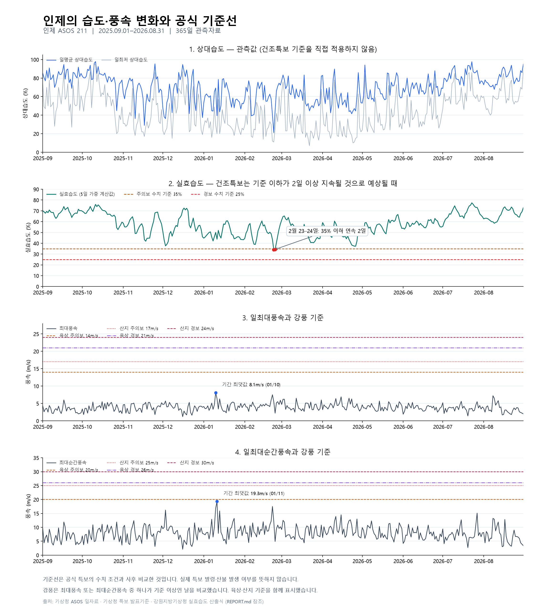

# 인제군 산불 위험 기상 조건 시계열 분석

## 데이터 점검

원본 데이터는 365일 62개 열로 구성되며 날짜 누락과 중복은 없었다. 풍속·습도 핵심 변수에는 결측치가 없어 원값을 사용했다. 전 기간 빈값인 비핵심 변수와 빈값 의미가 확인되지 않은 강수량 변수는 이번 분석에서 제외했다. 극단적 풍속·습도 값은 분석 목적상 이상치로 삭제하지 않았다.

분석용 표는 날짜 / 평균풍속 / 최대풍속 / 최대순간풍속 / 평균습도 / 최소습도의 365행 6열이다. 풍속 단위는 m/s, 습도는 %다. 원본의 minRhm은 일최저 상대습도다. 2026-04-23 일조시간은 빈값으로 유지하며 북춘천 값으로 대체하지 않았다.

## 공식 기준과 적용 방법

기상청의 건조주의보는 실효습도 35% 이하가 2일 이상 지속될 것으로 예상될 때, 건조경보는 실효습도 25% 이하가 2일 이상 지속될 것으로 예상될 때 발표한다. [기상청 특보 발표기준](https://www.weather.go.kr/w/forecast/guide/standard.do) (확인: 2026-09-16)

이는 일평균 상대습도나 일최저 상대습도에 35%·25%를 직접 적용하는 기준이 아니다. 본 분석은 실효습도를 계산해 두 수치 이하인 날과 2일 이상 연속 구간을 구분했다. **과거 관측값의 사후 비교이며 실제 특보 발령일이나 예보 판단을 재현한 결과가 아니다.**

실효습도는 강원지방기상청 보도자료 2쪽의 5일 산출식을 적용했다.

`EH(t) = 0.3 × [RH(t) + 0.7 RH(t−1) + 0.7² RH(t−2) + 0.7³ RH(t−3) + 0.7⁴ RH(t−4)]`

RH는 일평균 상대습도(avgRhm)다. 당일을 포함한 5일을 사용하며, 산출식에 없는 가중치 재정규화는 하지 않았다. [기상청 실효습도 산출식, 2쪽](https://www.kma.go.kr/kma/servlet/NeoboardProcess?bid=gangwon01&fno=2&k=ATC202204081327142_756f55de-2b9c-4a23-aa00-3e0c9aab39e0.pdf&mode=download&num=11&ses=USERSESSION), [지상기상관측지침 2022.12, 3.3.8절](https://data.kma.go.kr/resources/images/publication/지상기상관측지침%282022.12.%29.pdf)

시작 4일을 계산하기 위해 2025-08-28~08-31 인제 일자료를 기상청 API로 추가 조회했다. 이 4일은 계산용이며 365일 분석 집계에 포함하지 않았다. 일별 실효습도는 반올림 전 계산값을 임계값과 비교했다. 표에만 소수 둘째 자리까지 표시한다. 정수 반올림을 가정해도 35% 기준 변경 0일, 25% 기준 변경 0일로 이번 결과는 동일했다. 공식 운영 시스템의 세부 반올림이나 지역별 특보 판단까지 검증한 것은 아니다.

## 월별 결과

| 월 | 관측일수 | 평균실효습도 | 최저실효습도 | 기준35이하일수 | 기준25이하일수 | 기준35_2일이상구간일수 | 기준25_2일이상구간일수 |
| --- | --- | --- | --- | --- | --- | --- | --- |
| 2025-09 | 30 | 68.69 | 63.01 | 0 | 0 | 0 | 0 |
| 2025-10 | 31 | 67.57 | 52.68 | 0 | 0 | 0 | 0 |
| 2025-11 | 30 | 56.08 | 41.92 | 0 | 0 | 0 | 0 |
| 2025-12 | 31 | 55.74 | 37.61 | 0 | 0 | 0 | 0 |
| 2026-01 | 31 | 48.70 | 42.17 | 0 | 0 | 0 | 0 |
| 2026-02 | 28 | 49.08 | 33.92 | 2 | 0 | 2 | 0 |
| 2026-03 | 31 | 52.34 | 40.46 | 0 | 0 | 0 | 0 |
| 2026-04 | 30 | 48.68 | 37.29 | 0 | 0 | 0 | 0 |
| 2026-05 | 31 | 56.28 | 48.09 | 0 | 0 | 0 | 0 |
| 2026-06 | 30 | 57.81 | 53.13 | 0 | 0 | 0 | 0 |
| 2026-07 | 31 | 68.46 | 55.64 | 0 | 0 | 0 | 0 |
| 2026-08 | 31 | 66.13 | 58.49 | 0 | 0 | 0 | 0 |

실효습도 35% 이하인 날은 **2일**, 25% 이하인 날은 **0일**이다. 35% 이하가 2일 이상 연속된 구간은 **1개**, 25% 이하가 2일 이상 연속된 구간은 **0개**다.

### 기준 이하 날짜

| 날짜 | 평균습도 | 실효습도_계산값 |
| --- | --- | --- |
| 2026-02-23 | 21.10 | 33.92 |
| 2026-02-24 | 44.80 | 34.19 |

### 2일 이상 연속 구간

| 기준_pct | 시작일 | 종료일 | 연속일수 | 최저실효습도 | 2일이상 |
| --- | --- | --- | --- | --- | --- |
| 35 | 2026-02-23 | 2026-02-24 | 2 | 33.92 | True |

## 첫 질문에 대한 답

이번 1년의 관측자료에 공식 건조특보의 수치·지속 조건을 사후 적용한 결과는 위 표와 같다. 실제 건조주의보 발령 여부는 판정하지 않는다.

기존 “평균습도 하위 25%, 59.4% 이하” 분석은 공식 기준이 아니므로 본문의 근거에서 제외했다. 그때의 92일과 1월·4월 집중 결론을 공식 기준 결과로 사용하지 않는다. 이전 산출물은 outputs/archive_percentile에 구분 보관했다.

이 결과는 인제 ASOS 한 지점과 1년에 한정된다. 적은 발생 사례만으로 장기적인 계절 집중 경향을 확정하기 어렵다. 실효습도 기준을 넘는 날도 다른 조건에 따라 산불 위험이 있을 수 있다. 실제 특보 발령 여부는 별도 특보 이력으로 확인해야 한다. 강풍 및 건조·강풍의 같은 날짜 발생 비교는 아래에 이어서 제시한다.

## AI 사용 로그

이 과제에서는 ChatGPT/Codex를 데이터 점검, 분석 코드 작성·실행, 공식 자료 검색, 시각화, 결과 해석 및 보고서 문장 작성에 활용했다. 아래 검증은 AI가 도구로 수행한 확인이며, 사용자가 모든 코드와 결과를 독립적으로 검증했다는 뜻은 아니다. 분석 데이터는 기상청 관측자료이며 AI가 관측값을 생성하거나 빈값을 추정해 채우지 않았다.

| 사용 작업 | 사용 이유 | 검증 방법 및 수행 결과 |
| --- | --- | --- |
| CSV 기본정보 점검과 분석용 열 선택 | 반복 점검 시간을 줄이고 누락·중복·빈값을 일관되게 확인하기 위해 | 원본 365행·62열, 날짜 연속성과 중복 여부를 코드로 확인했다. 저장한 365행·6열 표를 읽어 원값과 일치하는지 비교했으며 원본 파일 해시로 변경 여부를 확인했다. |
| 빈값·극단값 처리 기준 검토 | 무조건적인 0 대체나 극단값 삭제를 피하고 대안을 검토하기 위해 | 기상청 ASOS 제공 안내와 대조해 계절적 미제공 항목을 구분했다. 강수량 빈값의 의미는 미확인으로 남겼다. IQR 후보는 오류로 확정하지 않았으며, 4월 23일 일조시간도 북춘천 값으로 대체하지 않았다. |
| 공식 기준 검색과 실효습도 계산 코드 작성 | 습도 지표와 특보 기준을 혼동하지 않고 재현 가능한 계산을 만들기 위해 | 기상청 특보 발표기준 및 실효습도 산출식과 대조했다. 추가 조회한 선행 4일을 포함해 365일을 계산하고, 첫날 계산을 별도의 스칼라 계산과 비교했다. 정수 반올림 가정에 따른 판정 변화가 0일임을 확인했다. |
| 월별 집계·연속 기간·건조와 강풍의 같은 날짜 발생 분석 | 반복 집계와 여러 조건의 비교를 자동화하기 위해 | 전체 분석을 재실행하고 일별·월별·연속 기간의 일수 합계가 맞는지 확인했다. 강풍 임계값과 정확히 같은 값의 포함 여부, 두 풍속 조건 중 하나만 충족하는 OR 조건을 별도 예시로 점검했다. |
| 시계열 그래프 생성 | 관측값 변화와 공식 기준선을 쉽게 비교하기 위해 | 생성한 PNG를 직접 열어 한글, 축 단위, 범례, 기준선, 날짜 표시를 육안 확인했다. 상대습도와 실효습도를 분리하고, 기준 이하 2일 및 최대풍속·최대순간풍속 최댓값 표시를 계산 결과와 대조했다. |
| 해석·문장 정리와 참고자료 검색 | 수치에 근거해 질문에 답하고 해석의 범위를 명확히 하기 위해 | 보고서 수치를 결과 CSV와 대조하고 출처 링크를 기록했다. 관측값의 수치 조건 충족을 실제 특보 발령이나 산불 발생으로 단정하지 않았다. 실제 산불 기록과의 통계적 검증은 수행하지 않았으며 후속 과제로 남겼다. |

**AI 제안의 수정 이력:** 처음 AI가 제안한 “평균습도 하위 25%”는 공식 기준이 아니었다. 사용자의 지적 이후 공식 실효습도 산출식과 건조특보 수치·지속 조건으로 분석을 수정했다. 이전 분위수 결과는 별도 보관하고 현재 결론의 근거에서 제외했다.

**남아 있는 검증 한계:** 실제 기상청 특보 발령 이력, 시간자료의 공식 QC, 산불 발생 기록과의 관계는 검증하지 않았다. 이 보고서는 한 관측소의 1년 관측자료를 이용한 사후 기상 조건 분석이다.

## 재현과 파일

- 실행: `python scripts/analyze_low_humidity.py` (pandas 필요)
- 분석용 표: `data/processed/wind_humidity_daily.csv`
- 일별 계산·조건: `outputs/effective_humidity_daily.csv`
- 월별 결과: `outputs/low_humidity_monthly.csv`
- 기준 이하 날짜: `outputs/low_humidity_days.csv`
- 연속 기간: `outputs/low_humidity_runs.csv`
- 본자료: `data/raw/inje_asos_211_daily_20250901_20260831.csv`
- 계산용 선행자료: `data/raw/inje_asos_211_daily_20250828_20250831.csv` (2026-09-16 조회)
- 원본 SHA256: `1d82c74f4ffecd4db14ce29866ad22a0aea8a940c2c40a7d76ea1732b1534916`
- 선행자료 SHA256: `31fa4eda21dc7aa4cb3c871358df96fa92bf02947f1288131ca7bd14c41e48bd`

원본 값은 보간·삭제·대체하지 않았다. 추가한 실효습도는 공식 산출식에 따른 분석자 계산값이며 기상청이 직접 제공한 실효습도 관측값은 아니다.

## 두 번째 질문: 강풍 기간은 언제 집중되는가?

기상청의 강풍특보 기준을 아래와 같이 적용했다. 풍속 또는 순간풍속 중 하나만 기준 이상이어도 수치 충족으로 센다. 단위는 m/s다. [기상청 특보 발표기준](https://www.weather.go.kr/w/forecast/guide/standard.do) (확인: 2026-09-16)

| 비교기준 | 풍속_mps | 순간풍속_mps | 수치충족일수 | 실효습도35이하와동일일 | 건조2일이상구간중 |
| --- | --- | --- | --- | --- | --- |
| 육상_주의보 | 14 | 20 | 0 | 0 | 0 |
| 산지_주의보 | 17 | 25 | 0 | 0 | 0 |
| 육상_경보 | 21 | 26 | 0 | 0 | 0 |
| 산지_경보 | 24 | 30 | 0 | 0 | 0 |

기준 비교에는 일평균풍속이 아니라 일최대풍속(maxWs)과 일최대순간풍속(maxInsWs)을 사용했다. 이는 일자료의 극값과 특보 수치 기준을 대조하는 사후 분석이다. 예보에 기반한 실제 특보 발령 여부를 판정하지 않는다. 인제군 전체를 산지 또는 일반 육상으로 단정하지 않고 양쪽 기준을 병렬 제시했다. 한 관측소의 결과를 군 전체나 주변 산지에 적용하지 않는다.

365일 중 최대풍속의 최댓값은 **8.1m/s**, 최대순간풍속의 최댓값은 **19.3m/s**였다. 육상 주의보 수치 기준(14 또는 20m/s)에 도달한 날은 **0일**이다. 더 높은 산지·경보 기준도 위 표와 같다. 따라서 이 자료에서는 공식 강풍 수치 기준에 해당하는 날의 계절적 집중 시기를 찾을 수 없다. “그해 인제군에 강풍특보가 없었다”거나 “바람에 의한 위험이 없었다”는 의미는 아니다.

### 월별 바람의 크기

| 월 | 관측일수 | 평균풍속_월평균 | 최대풍속_월최대 | 최대순간풍속_월최대 | 실효습도35이하일수 |
| --- | --- | --- | --- | --- | --- |
| 2025-09 | 30 | 1.31 | 6.00 | 11.90 | 0 |
| 2025-10 | 31 | 1.55 | 5.50 | 11.90 | 0 |
| 2025-11 | 30 | 1.33 | 5.30 | 12.40 | 0 |
| 2025-12 | 31 | 1.36 | 5.70 | 16.20 | 0 |
| 2026-01 | 31 | 1.45 | 8.10 | 19.30 | 0 |
| 2026-02 | 28 | 1.62 | 7.50 | 17.50 | 2 |
| 2026-03 | 31 | 1.50 | 6.50 | 12.50 | 0 |
| 2026-04 | 30 | 1.76 | 6.90 | 14.50 | 0 |
| 2026-05 | 31 | 1.44 | 5.70 | 12.30 | 0 |
| 2026-06 | 30 | 1.53 | 5.30 | 11.10 | 0 |
| 2026-07 | 31 | 1.34 | 5.60 | 15.10 | 0 |
| 2026-08 | 31 | 1.43 | 7.20 | 13.20 | 0 |

이 표는 기준 미만의 바람도 포함한 기술통계다. 기준을 낮춰 강풍 사례를 만들지 않았다. 평균풍속의 월평균과 월중 최대순간풍속은 서로 다른 특성을 나타낸다.

### 최대순간풍속 상위 10일

| 날짜 | 평균풍속 | 최대풍속 | 최대순간풍속 | 평균습도 | 실효습도_계산값 | 육상_주의보_수치충족 |
| --- | --- | --- | --- | --- | --- | --- |
| 2026-01-11 | 2.30 | 6.40 | 19.30 | 39.40 | 43.77 | False |
| 2026-02-22 | 3.40 | 7.50 | 17.50 | 40.00 | 43.39 | False |
| 2026-01-10 | 3.70 | 8.10 | 16.90 | 69.30 | 50.03 | False |
| 2025-12-03 | 2.30 | 5.70 | 16.20 | 36.30 | 37.61 | False |
| 2026-01-13 | 2.50 | 6.30 | 15.90 | 43.60 | 47.19 | False |
| 2026-07-27 | 0.90 | 5.50 | 15.10 | 88.30 | 73.18 | False |
| 2026-04-15 | 2.90 | 6.90 | 14.50 | 63.80 | 48.86 | False |
| 2026-04-11 | 3.30 | 6.40 | 13.90 | 64.60 | 58.19 | False |
| 2026-01-24 | 1.90 | 5.20 | 13.20 | 47.90 | 44.16 | False |
| 2026-08-08 | 4.10 | 7.20 | 13.20 | 72.50 | 59.89 | False |

상위 10일은 값의 순위일 뿐 별도의 강풍 판정 기준이 아니다.

## 세 번째 질문: 건조와 강풍이 같은 날 나타났는가?

실효습도 35% 이하와 강풍 수치 기준 충족이 같은 날짜에 나타나는지를 비교했다. 건조 2일 이상 연속 구간에 포함된 날짜와의 교집합도 따로 계산했다. 일자료로는 하루 안에서 같은 시각에 두 조건이 겹쳤는지 알 수 없다.

| 날짜 | 평균풍속 | 최대풍속 | 최대순간풍속 | 평균습도 | 실효습도_계산값 | 육상_주의보_수치충족 |
| --- | --- | --- | --- | --- | --- | --- |
| 2026-02-23 | 3.30 | 5.50 | 12.10 | 21.10 | 33.92 | False |
| 2026-02-24 | 0.70 | 2.20 | 4.90 | 44.80 | 34.19 | False |

육상 주의보 수치 기준의 강풍 자체가 **0일**이므로, 실효습도 35% 이하와 같은 날 충족한 경우도 **0일**이다. 산지 및 경보 기준의 같은 날짜 발생도 요약 표에 제시했다. 건조 전후의 강풍은 같은 날짜 발생에 포함하지 않는다.

## 국내 선행연구로 보완한 해석

### 이 분석이 답하는 질문의 범위

습도와 풍속 사이의 상관관계, 각 기상요인과 산불 발생의 관계, 산불이 발생한 뒤의 확산·대형화는 서로 다른 질문이다. 현재 분석은 특보 수치 조건의 날짜별 충족 여부를 비교했으며 상관분석이나 산불 발생 모형을 추정하지 않았다. 따라서 **같은 날짜에 두 기준을 충족한 사례가 0일이라는 결과는 습도와 풍속이 무관하다는 증거가 아니다.** 특히 강풍 기준 충족 자체가 0일이므로 그 교집합으로 연관성을 평가할 수 없다.

기상청의 건조·강풍특보 기준은 이번 자료를 비교하는 기준선으로 사용했다. 이 기준을 산불 발생의 필요조건이나 산불 위험도 모형으로 사용하지 않는다. 본 보고서의 목적은 **산불 관련 기상요인의 시간적 변화와 공식 특보 수치 조건을 탐색하고, 국내 연구와 비교해 해석하는 것**이다.

### 확인한 국내 논문 3편

아래 요약은 2026-09-16에 확인한 KCI의 저자 초록과 서지정보에 근거한다. 논문 전체의 표·원자료·추정 과정을 재현한 것은 아니다. 연구 결과를 인제의 2025~2026년 산불 기록으로 대체하지 않는다.

| 연구 | 대상과 주요 결과 | 이번 보고서에 적용할 점 |
| --- | --- | --- |
| 전보람·채희문(2017), 「한국의 산불 발생과 기상인자와의 관계 분석에 관한 연구」, 한국방재학회논문집 17(5), 197–206. [저자 초록·서지정보](https://www.kci.go.kr/kciportal/ci/sereArticleSearch/ciSereArtiView.kci?sereArticleSearchBean.artiId=ART002277665), DOI: 10.9798/KOSHAM.2017.17.5.197 | 1990~2015년 국내 산불 통계를 분석했다. 봄철, 특히 4월에 발생이 높았으며 일평균 상대습도·최고기온·평균풍속 순으로 유의성이 높다고 보고했다. 행정구역 평균 기상값을 사용한 예측의 일치율 한계도 제시했다. | 국내 장기 통계의 봄철 집중을 배경으로 설명할 수 있다. 하지만 인제의 이번 1년에도 4월 산불이 가장 많았다고 결론낼 수는 없다. 한 관측소의 대표성에도 한계가 있다. |
| 원명수·장근창·윤석희(2018), 「봄철과 가을철의 기상에 의한 전국 통합 산불발생확률 모형 개발」, 한국농림기상학회지 20(4), 348–356. [저자 초록·서지정보](https://www.kci.go.kr/kciportal/ci/sereArticleSearch/ciSereArtiView.kci?sereArticleSearchBean.artiId=ART002425851), DOI: 10.5532/KJAFM.2018.20.4.348 | 봄철 모형에는 평균기온·상대습도·실효습도·평균풍속, 가을철에는 평균기온·상대습도·평균풍속이 포함되며 통계적 유의성을 보고했다. 초록의 평균풍속 회귀계수는 두 계절 모두 음수다. | 기상요인을 함께 고려할 근거가 된다. 다만 통계적 유의성이 항상 “바람이 강할수록 발생이 증가한다”는 뜻은 아니며, 발생 확률과 확산 위험을 구분해야 한다. 이 계수를 바람의 일반적인 보호 효과로 해석하거나 현재 일자료에 그대로 대입하지 않는다. |
| 강성철·원명수·윤석희(2016), 「사례분석을 통한 소나무림에서의 풍속과 실효습도 변화에 의한 대형산불 위험예보」, 한국지리정보학회지 19(4), 146–156. [저자 초록·서지정보](https://www.kci.go.kr/kciportal/ci/sereArticleSearch/ciSereArtiView.kci?sereArticleSearchBean.artiId=ART002188457), DOI: 10.11108/kagis.2016.19.4.146 | 과거 20년의 100 ha 이상 대형산불 37건과 소나무림 조건을 검토했다. 사례들의 평균풍속은 평균 5.3 m/s, 실효습도는 평균 30%였으며 건조 지속·바람·임상 조건을 함께 고려하는 예보 방안을 제안했다. | 산불의 대형화는 기상뿐 아니라 연료 조건과 함께 해석할 필요가 있다. 사례 평균을 위험 임계값으로 삼지 않는다. 논문의 평균풍속을 현재 그래프의 일최대풍속·최대순간풍속과 동일시하지 않는다. |

### 인제 자료와 연결해 말할 수 있는 내용

1. **건조한 시기와 실제 산불이 많은 시기는 구분한다.** 이번 자료의 월평균 실효습도는 2026년 4월 48.68%, 2025년 9월 68.69%로 20.01%p 차이가 났다. 이는 이번 관측기간의 기상적 건조 차이다. 국내 장기 연구의 봄철 산불 집중과 비교할 배경은 되지만, 이 차이가 인제의 산불 증가를 입증하지는 않는다.
2. **공식 기준의 동시 충족이 없어도 산불과 기상의 관계를 부정할 수 없다.** 실효습도 35% 이하가 이어진 2월 23~24일의 최대순간풍속은 각각 12.1·4.9 m/s였다. 해당 날짜의 산불 여부는 미확인이므로 위험도나 화재 발생의 정답 사례로 표시하지 않는다. 국내 논문은 특보 기준 통과 여부뿐 아니라 연속적인 기상값과 여러 요인을 사용한다.
3. **바람의 계절적 특징은 평균과 극값을 나누어 본다.** 월평균 풍속은 4월 1.76 m/s로 가장 높았지만 연중 최대순간풍속 19.3 m/s는 1월 11일에 나타났다. 이 차이는 평균적 바람과 짧은 돌풍을 구분할 이유다. 이것만으로 산불 발생 또는 피해면적과의 관계를 추정하지 않는다.

위 세 항목의 관측 수치는 앞의 월별 표와 시계열 그래프에 근거한다. 선행연구와의 연결은 해석이며, 인제의 실제 산불에 대한 검증 결과는 아니다.

### 추가 검증에 필요한 자료와 방법

풍속과 습도 자체의 관계를 알아보려면 산점도와 상관계수를 별도로 계산하고 계절 변화의 영향을 살펴봐야 한다. 산불이 언제 많이 발생하는지 검증하려면 동일 기간·지역의 발생일시·위치·건수 기록을 확보하고, 기록의 수록 범위를 확인한 뒤 발생하지 않은 날도 포함해 비교해야 한다. 대형화 질문에는 피해면적과 발화 이후의 시간별 기상자료가 추가로 필요하다. 인제 자료가 적으면 다년 자료를 확보하고, 논문의 변수 정의·시간 단위·실효습도 계산 방식까지 확인한 뒤 모형 적용 가능성을 판단한다.

**AI 사용 로그 보완:** 국내 논문 검색·초록 요약·해석 보완에 AI를 사용했다. 서로 다른 연구 질문과 변수 정의를 비교하기 위한 목적이다. 저자·연도·학술지·DOI를 KCI 서지정보와 대조하고, 요약은 저자 초록에서 확인되는 내용으로 제한했다. 인제 산불 기록과의 통계 검증이나 논문 전체의 재현을 수행했다고 주장하지 않는다.

## 현재 분석의 결론과 후속 과제

이 1년의 인제 ASOS 관측값에서는 실효습도 35% 이하가 2일 연속 나타난 구간이 확인됐으나 공식 강풍 수치 기준에 도달한 날은 없었다. 건조·강풍의 같은 날짜 기준 충족도 없었다. 이 결과 자체를 그대로 보고하며 기준을 바꾸어 사례를 늘리지 않는다.

실제 산불 발생 기록과의 비교는 사용자 결정에 따라 후속 과제로 남겼다. 국내 선행연구는 습도·풍속을 산불 관련 변수로 검토할 근거를 제공하지만, 현재 보고서의 기상 조건 분석이 인제의 산불 발생률·인과관계·예측 정확도를 검증한 것은 아니다. 습도와 풍속이 무관하거나 강풍특보 기준 미만에서 산불 위험이 없다는 결론도 내리지 않는다. 후속 검증에는 인제의 날짜별 산불 기록과 더 긴 기간의 관측자료가 필요하다.

### 전체 분석 재실행 및 결과

- 전체 실행: `python scripts/analyze_wind_dry_overlap.py` (습도 분석도 먼저 재실행한다)
- 일별 판정: `outputs/wind_dry_daily.csv`
- 월별 바람·같은 날짜 발생: `outputs/wind_monthly.csv`
- 네 가지 공식 수치 기준 비교: `outputs/wind_threshold_summary.csv`
- 최대순간풍속 상위 날짜: `outputs/wind_top10_days.csv`
- 건조한 날의 바람: `outputs/dry_days_wind_comparison.csv`

`analyze_low_humidity.py`만 실행하면 보고서가 습도 부분으로 재생성되므로 전체 보고서에는 위 전체 실행 명령을 사용한다.

## 습도·풍속 시계열 그래프

상대습도 관측값과 계산한 실효습도를 별도 패널로 구분했다. 35%·25% 기준선은 실효습도에만 적용했다. 최대풍속과 최대순간풍속은 서로 다른 기준선을 사용한다. 건조특보의 지속·예상 조건과 강풍의 OR 조건은 앞의 분석 방법을 따른다.

그래프에서는 겨울·봄의 실효습도가 여름·초가을보다 대체로 낮게 나타난다. 기준선 아래에 해당하는 구간은 2026-02-23~02-24이며, 두 풍속 계열은 모두 육상 주의보 기준선에 도달하지 않는다. 한 관측소의 1년 변화이므로 장기 기후 특성이나 실제 특보·산불 발생으로 일반화하지 않는다.

### 시간 축·스케일·집계 단위 선택

- **시간 축:** 2025-09-01~2026-08-31의 365일을 날짜 오름차순으로 표시했다. 날짜 중복과 누락은 모두 0건이다. 가로축 눈금은 월 단위지만, 선을 구성하는 관측값은 일별 값이다.
- **스케일:** 습도(%)와 풍속(m/s)을 별도 패널로 나누고, 세로축은 0부터 표시했다. 상대습도는 0~105%, 실효습도는 0~90%, 최대풍속은 0~28 m/s, 최대순간풍속은 0~35 m/s로 설정해 관측값과 기준선을 함께 볼 수 있게 했다. 이 때문에 풍속 변화가 상대적으로 작아 보일 수 있으므로 실제 범위와 최댓값 표기를 함께 확인한다. 최대풍속 범위는 1.2~8.1 m/s, 최대순간풍속 범위는 2.1~19.3 m/s이다. 패널마다 축 범위가 다르므로 선의 기울기만으로 변수 간 변화량을 비교하지 않는다.
- **집계 단위:** 일별 그래프는 건조 조건의 2일 연속 여부와 짧은 강풍 피크를 보존하기 위해 선택했다. 월별 표는 연중 어느 시기에 조건 충족일이 집중되는지 비교하기 위해 사용하며, 월별 일수가 다르므로 일수와 비율을 함께 해석한다. 월평균으로는 개별 날짜의 기준 충족 여부를 판정하지 않는다. 이번 질문에는 일별 지속성과 월별 분포가 직접 대응하므로 주별 집계는 추가하지 않았다.

그래프까지 포함한 전체 재실행: `python scripts/plot_weather_timeseries.py`
필요 패키지: `python -m pip install pandas matplotlib`
그림 파일: `outputs/weather_timeseries.png`, `outputs/weather_timeseries.svg`.
이 명령은 습도·강풍 분석을 재실행하고 보고서에 그래프를 추가한다.
